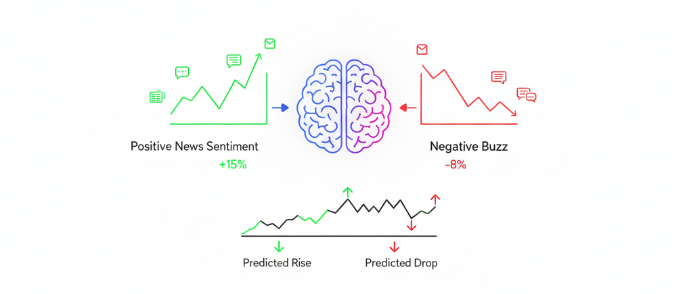

# Sentiment-Enhanced Stock Predictor (MVP)




## Table of Contents
- [Executive Summary](#executive-summary)
- [Project Description](#project-description)
- [Data Sources](#data-sources)
- [Features & Transformations](#features--transformations)
- [Modeling & Strategy](#modeling--strategy)
- [Repo Structure](#repo-structure)
- [End-to-End Workflow](#end-to-end-workflow)
- [How to Reproduce](#how-to-reproduce)
- [Notes](#notes)
- [Improvements](#improvements)
- [References](#references)
- [Contributors](#contributors)
- [License](#license)
- [Acknowledgments](#acknowledgments)
- [Contributions and Feedback](#contributions-and-feedback)

## Executive Summary
This project delivers a robust, end-to-end machine learning (LSTM/RNN) pipeline for short-term stock prediction, integrating both price and news sentiment data. By combining financial time series with real-world news sentiment, the system aims to improve predictive accuracy and support conservative trading decisions. The workflow is fully automated, modular, and designed for reproducibility, with a dashboard for interactive results exploration.

## Project Description
Financial markets are influenced by a complex interplay of quantitative signals and qualitative sentiment. This project addresses the challenge of predicting short-term (3-day) stock movements by leveraging both historical price data and sentiment extracted from news headlines. The pipeline fetches and merges price and news data, applies sentiment scoring, and engineers a rich set of features including technical indicators and sentiment metrics. An LSTM model is trained for each ticker to capture temporal dependencies and sentiment effects. The trading strategy is intentionally conservative, executing trades only when the model's confidence exceeds a set threshold, and is evaluated using industry-standard metrics such as CAGR, Sharpe ratio, and drawdown. The entire workflow is automated and reproducible, with results visualized in an interactive dashboard. This approach demonstrates how combining alternative data sources with deep learning can enhance decision-making in algorithmic trading.

## Data Sources
- **Stock Prices:** Fetched via [Yahoo Finance](https://finance.yahoo.com/) ([yfinance Python package](https://github.com/ranaroussi/yfinance))
- **News Headlines:** Collected using both [NewsAPI](https://newsapi.org/) and [Yahoo Finance](https://finance.yahoo.com/) (via yfinance)
- **Sentiment Scores:** Computed using [NLTK VADER](https://github.com/cjhutto/vaderSentiment)

All data is combined into a unified dataset for feature engineering and modeling. No raw data files are committed to this repository; see instructions below for data access.

## Features & Transformations
- Technical indicators (moving averages, returns, volatility)
- Sentiment features (daily scores, headline counts)
- Target variable: 3-day future return
- Feature engineering and EDA are performed in notebooks and scripts

## Modeling & Strategy
- LSTM models trained per ticker
- Conservative trading rules: only trade when predicted probability exceeds threshold
- Backtesting with metrics: CAGR, Sharpe ratio, drawdown

## Repo Structure
```
sentiment-stock-predictor/
├── data/               # raw & processed data (gitignored)
├── notebooks/          # EDA, feature engineering, modeling
├── src/                # source code: data, features, sentiment, train, predict
├── app/                # Streamlit dashboard
├── models/             # saved models and scalers
├── reports/            # predictions, metrics, equity curves
├── requirements.txt
├── README.md
└── LICENSE
```

## End-to-End Workflow
1. **Build dataset:** Fetch prices & headlines, compute sentiment, engineer features
2. **EDA & Feature Engineering:** Explore and transform data
3. **Model Training:** Train LSTM models per ticker
4. **Prediction & Backtest:** Generate predictions and simulate trading
5. **Visualization:** Review results in dashboard

## How to Reproduce
### Environment Setup
- Create and activate a virtualenv (Python 3.10+ recommended)
- Install dependencies: `pip install -r requirements.txt`
- Add your NewsAPI key in `.env` in the project root:
  ```
  NEWSAPI_KEY=your_key_here
  ```

### Run Workflow
- Build dataset:
  ```bash
  python -m src.build_dataset --tickers AAPL,MSFT,NVDA,TSL,AMZN,GOOGL,META,INTL --start 2023-01-01 --end 2025-09-01 --out data/processed/features.parquet
  ```
- Train models:
  ```bash
  python -m src.train --features data/processed/features.parquet --lookback 10 --epochs 10
  ```
- Predict & backtest:
  ```bash
  python -m src.predict_and_backtest --features data/processed/features.parquet --lookback 10 --threshold 0.75 --hold_days 3
  ```
- Launch dashboard:
  ```bash
  streamlit run app/dashboard.py
  ```

## Notes
- The sentiment ingestor uses [NewsAPI](https://newsapi.org/) + [NLTK VADER](https://github.com/cjhutto/vaderSentiment) (free tier).
- Conservative rules: only trade when `prob >= threshold` (default 0.75), limited holding period, and fees included.
- Check `reports/` for metrics and outputs.

## Improvements
- Add more advanced models (e.g., XGBoost, Transformer-based architectures)
- Integrate additional data sources (e.g., social media sentiment, alternative financial APIs)
- Implement real-time data ingestion and prediction
- Enhance risk management and portfolio optimization strategies
- Containerize and deploy the solution (e.g., Docker, cloud platforms)
- Add automated reporting and alerting (e.g., Telegram bot, email notifications)

## References
- [yfinance documentation](https://github.com/ranaroussi/yfinance)
- [NewsAPI documentation](https://newsapi.org/docs)
- [NLTK VADER paper](https://ojs.aaai.org/index.php/AAAI/article/view/14550)
- [LSTM Networks](https://colah.github.io/posts/2015-08-Understanding-LSTMs/)
- [Backtesting in Python](https://www.backtrader.com/)
- [Sharpe Ratio Explained](https://www.investopedia.com/terms/s/sharperatio.asp)
- [CAGR Explained](https://www.investopedia.com/terms/c/cagr.asp)

## Contributors
Abhirup Ghosh ([email](mailto:abhirup.ghosh.184098@gmail.com))

## License
This project is licensed under the [MIT License](LICENSE).

## Acknowledgments
- [Ivan Brigida](https://github.com/realmistic)
- [Alexey Grigorev](https://github.com/alexeygrigorev)
- [DataTalks.Club](https://datatalks.club/)

## Contributions and Feedback
We welcome contributions and feedback from the community. If you encounter issues, have suggestions, or want to contribute code, please open an issue or submit a pull request. Your input helps improve the project for everyone!

